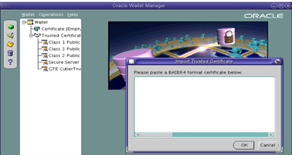
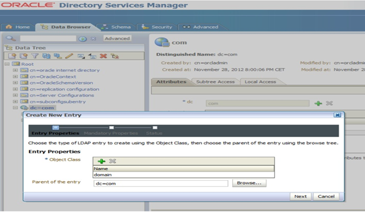
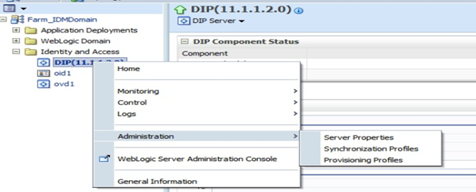

---
layout: post
title: "Oracle Internet Directory Migration to Oracle Unified Directory"
date: 2021-09-17
comments: true
author: Praveen Muthyala
authorAvatar: ''
bio: ""
published: false
authorISRacker: true
categories:
 -Oracle
 metaTitle: "Oracle Internet Directory Migration to Oracle Unified Directory" 
 metaDescription: "The blog introduces Oracle Internet Directory (OID) migration to Oracle Unified Directory (OUD) and third-party directory servers."
 ogTitle: "Oracle Internet Directory Migration to Oracle Unified Directory"
 ogDescription: The blog introduces Oracle Internet Directory (OID) migration to Oracle Unified Directory (OUD) and third-party directory servers."
 slug: "oracle-internet-directory-migration-to-oracle-unified directory"

 ---
 **Oracle Internet Directory** is a Lightweight Directory Access Protocol (LDAP) server which uses external oracle database to store the data and provides single sign-on solutions for Oracle Applications.

•	OID provides high performance for large applications.

•	OID is the most secure directory services providing security at each level from the data in transit to storage or backup.

•	It provides Storage and Synchronization services.

Oracle Unified Directory is an Oracle next generation all in one directory solution with storage, proxy, synchronizing and virtualization capabilities. This LDAP server is completely written in JAVA for large supports scalable deployments to provide high performance.
<!--more-->

You can use OUD for completing the following:

•	LDAP Directory server to store data.

•	As a Proxy server interface between client and directory server.

•	Replication gateway between Oracle Unified Directory and Oracle Directory Server Enterprise Edition.

There are two approaches for migrating OID to OUD:
1.	Synchronizing OUD with OID using DIP
2.	Schemasync 

**1.Synchronizing OUD with OID using DIP**
Pre Step

You need to enable External change log as a pre-step to proceed with migration. The External Change log (ECL) is available by default on any server instance that includes both Directory server and Replication server. The ECL is enabled when directory server is configured as part of replication topology during installation, or you can configure replication by running **dereplication** command.
Example:

`$ dsreplication enable-changelog -h localhost -p 4444 -D "cn=directory manager" -j pwd-file -r 8989 -b dc=example,dc=com -X -n`

Verify change log is enabled, by running below command.

`ldapsearch -h <HOSTNAME> -p <PORT> -D "cn=<DM_ADMIN>" -w <PASSWORD> -s base -b "" "objectclass=*" namingContexts
version: 1
dn:
namingContexts: cn=changelog
namingContexts: <SUFFIX_DN>`

DIP and OID are configured and deployed 

**Enable SSL on OID**

DIP-OID synchronization is possible with SSL mode only, you need to create OID wallet to allow the bind to OID in SSL mode. A self-signed wallet is needed to create using Enterprise manager and that should be copied to the Oracle wallet using the following steps.

_Steps to create OID Self signed Certificate:_

Export Trusted certificate and copy it to Oracle Wallet manager. 

Create OID Wallet from OWM and copy trusted certificate to wallet

Bind to OID1 in SSL mode using below command.

`ldapbind -h <OID_HOSTNAME> -p <OID_PORT> -D "cn=<OID_ADMIN>" -w <PASSWORD> -U 2  -W "file:/home/oracle/oid1_client_wallet" -P "<PASSWORD>"
bind successful`

**DIP Configuration Steps:**

Create keystore using Keytool with OID self-signed certificate

`keytool -importcert -trustcacerts -file /home/oracle/certificates_base/oid1_selfsigned_cert.txt -keystore $HOME/dip_keystore
Enter keystore password:
Re-enter new password:
Trust this certificate? [no]:  yes`

`Certificate was added to keystore`

Update DIP Config to point keystore location

`$ORACLE_HOME/bin/manageDIPServerConfig set -attribute keystorelocation -h  <OID_HOSTNAME> -p <WLS_PORT> -D <WL_ADMIN> -value $HOME/dip_keystore <wls admin user password>`
`Connection parameters initialized.`
`Connected successfully.`
`The attribute keystorelocation is successfully changed to value /home/oracle/dip_keystore.`

Configure DIP in SSL V2 mode using below command.

`$ORACLE_HOME/bin/manageDIPServerConfig set -attribute sslmode -h  <OID_HOSTNAME> -p <WLS_PORT> -D <WLS_ADMIN> -value 2 <wls admin user password>`

`Connection parameters initialized.`

`Connected successfully.`

`The attribute sslmode is successfully changed to a value of 2.`

Update Java Key store using "wlst.sh" and restart OID and DIP services to effect these changes.

`wlst.sh
connect('<WLS_ADMIN>','<PASSWORD>','t3://localhost:<EM_PORT>')
createCred(map="dip",key="jksKey", user="<JKS_USER>",password="<PASSWORD>")
disconnect()`

**Synchronization profile OUD and OID**

You need to create Suffix_dn entry in OID to populate OUD data.  It is very important to choose which suffix to create and it will be directly used during synchronization profile management.
Select parent directory as shown in the following screenshot.

_Create Synchronization profile_

Go to Menu > select OID in Identity and Access > OID Administration and select Synchronization profile as shown in the following image.

Create below 2 Synchronization profiles.

OUD > OID: OUDImport

OID > OUD: OUDExport

You need to decide whether OID should be used as a source or destination while creating synchronization profile.

Use host name and port as OID hostname and port number as OID is being used as a source.
Once above mapping is complete, OUDImport /OUDExport maps “ou=people, dc=people,dc=com” on each side as reflected in the following screenshot.

Once mapping is enabled, by default the following attributes get automatically mapped.

**Bootstrapping data from OID to OUD**

Add OID ACI to allow DIP to access the suffix DN, inorder to perform syncProfileBootstrap.

Add OID ACI using the following commands.

`dn: ou=People,dc=people,dc=com
changetype :modify
add: orclaci
orclaci:access to entry by dn="orclodipagentname=OUDImport,cn=subscriber profile,cn=changelog subscriber,cn=oracle internet directory" (browse,add,delete)`

`orclaci: access to attr=(*) by group="orclodipagentname=OUDImport,cn=subscriber profile,cn=changelog subscriber,cn=oracle internet directory" (read,search,write,selfwrite,compare)`

Run ldapmodify command to add ACI.

`ldapmodify -h <OID_HOSTNAME> -p <OID_PORT> -D cn=<OID_ADMIN> -w <PASSWORD> -f aci_oudimport.ldif`

Run the following command to bootstrap data from OID to OUD.

`syncProfileBootstrap -h <OID_HOSTNAME> -p <WLS_PORT> -D <WLS_ADMIN> -pf OUDImport`

`Connection parameters initialized.`

`Connecting at <OID_HOSTNAME>:<WLS_PORT>, with userid "<WLS_ADMIN>"..
Connected successfully.`

`The bootstrap operation completed, the operation results are`

`entries read in bootstrap operation: 1907`

`entries filtered in bootstrap operation: 0`

`entries ignored in bootstrap operation: 0`

`entries processed in bootstrap operation: 1906`

`entries failed in bootstrap operaton: 1`

Now we will be able to see suffix data at OUD side.

`ou=people,dc=people,dc=com`

**2. Schemasync**
Schemasync utility enables to synchronize schema attributes and object classes between OID and other the third party LDAP Directory.

_Syntax for Schemasync_

`schemasync -srchost hostname -srcport port -srcdn bindDN -srcpwd password -dsthost hostname -dstport port -dstdn bindDN -dstpwd password [-ldap]`

-srchost – Host name of source directory server.

-srcport – Source directory source LDAP listening port

-srcdn – The DN of the user used to bind to the source directory.

-srcpwd – The user password used to bind to the source directory.

-dsthost – Host name of Destination directory server.

-destport – LDAP listening port for Destination directory server.

-dstdn – DN of the user used to bind to the destination directory server.

-ldap – When we use LDAP, Schema changes are applied directly from the source LDAP to destination LDAP.

`schemasync -srchost srchost.domain.com -srcport 3060 -srcdn "cn=orcladmin" \
   -dsthost dsthost.domain.com -dstport 3060 \
   -dstdn "uid=superuser,ou=people,dc=people,dc=com" -ldap`

Once the above command is executed, verify DN details in the Destination directory server.

**Conclusion**

The methods show in this post to migrate existing OID store to OUD to support large applications to enable single sign-on solutions. OUD provides high performance in users authentication process as LDAP server stores date. Migration steps are very straightforward to implement in any type of applications.

**Reference Links** :
https://docs.oracle.com/cd/E48246_01/reference.1111/e10035/syntax_odip.htm#BEHCFFGJ

OUD - Synchronizing OUD With OID Using DIP (OID Used as a Backend Store) (Doc ID 1510011.1)

How to Copy or Migrate Users and Groups from One OID (Oracle Internet Directory) server to Another OID server (Doc ID 251776.1)
